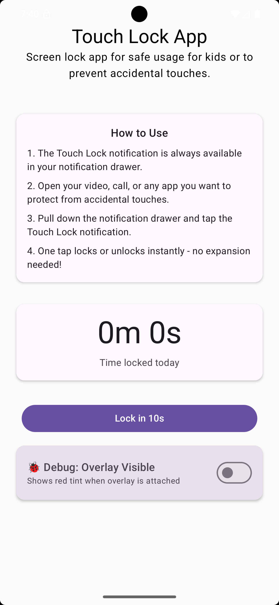
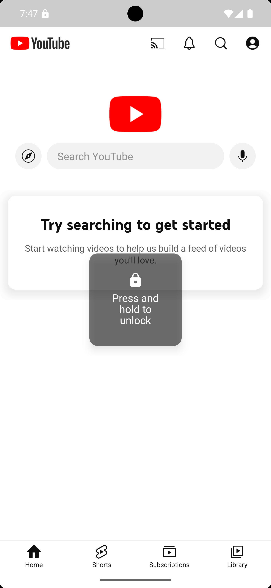
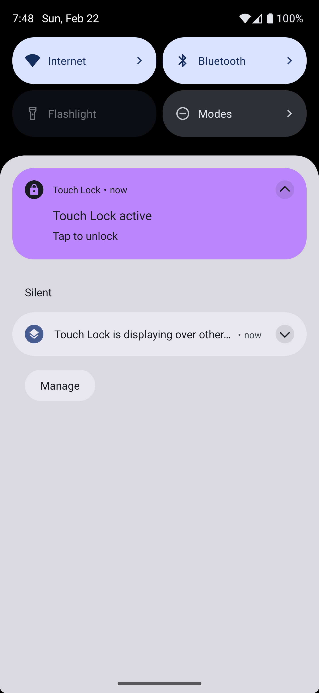

# Touch Lock
[](https://github.com/jmuci/android-touch-lock/actions/workflows/unit-tests.yml)


**Touch Lock** is a lightweight Android utility app that temporarily disables touch input on the screen while keeping content visible.

It is designed for **supervised scenarios**, such as:

- Letting a toddler watch a video without accidentally tapping UI controls

- Preventing hang-ups or unintended interactions during video calls

- Displaying content hands-free (recipes, presentations, timers, etc.)


The app works fully **offline** and does not require an account or network access.

---

## Key Features

- **Touch-blocking overlay** that prevents all screen interaction

- **Quick activation via persistent notification**

- **10-second countdown** before locking (with cancel option)

- **Daily Usage Tracking** – Tracks how long the lock has been active today

- **Safe unlock gesture** – double-tap to reveal handle, then hold 1 second to unlock

- **Haptic feedback** on lock and unlock

- **Works without internet**

- Designed to be simple, transparent, and Play Store-compliant

| Main UI | Unlock Handle | Notification Lock |
|---------|---------------|-------------------|
|  |  |  |

> Touch Lock does **not** attempt to be a full parental control or kiosk app.
> It focuses on a single, well-defined problem: temporarily disabling touch input.

---

## How It Works

1. Parent starts a video or app

2. Enables Touch Lock via notification or app UI (10-second countdown)

3. Overlay intercepts all touch events

4. Usage timer runs only while lock is enabled

5. Usage resets automatically at midnight

> **Known limitations**: 
> - Gestures on the system UI (drag the notifications bar or press on the navigation menu)
> - Some video call apps (e.g. WhatsApp) may automatically minimize
> the call to picture-in-picture when touch locking is enabled. This behavior is
> controlled by the calling app and cannot be overridden safely by Touch Lock.

---

## What This App Does _Not_ Do (by Design)

- It does **not** monitor or inspect other apps' UI

- It does **not** collect usage data or analytics

- It does **not** block system gestures (e.g. notification shade, status bar)

- It does **not** require Accessibility services


These constraints are intentional and align with Android platform and Play Store best practices.

---

## Technical Documentation

For engineering-focused documentation:

- **[Architecture Guide](docs/ARCHITECTURE.md)** – System design, data flow, component responsibilities, known constraints
- **[Debugging Guide](docs/DEBUGGING_GUIDE.md)** – Troubleshooting, logcat tips, common issues
- **[Testing Guide](docs/TESTING_GUIDE.md)** – Testing strategy, examples, anti-patterns
- **[Learnings & Tradeoffs](docs/learnings.md)** – Design decisions and why-not-X explanations

---

## Architecture Overview

Touch Lock follows a clean, layered architecture optimized for correctness and lifecycle safety.

### High-level layers

```
          UI (Jetpack Compose)
                   ↓
          ViewModel (StateFlow)
                   ↓
          Domain / Use Cases
                   ↓
              Repository
                   ↓
Foreground Service + Overlay Runtime
```

### Core principles

- **Single source of truth**: The foreground service owns the lock state. UI only _requests_ changes.

- **Loose coupling**: UI does not directly interact with system services or `WindowManager`.

- **Lifecycle-aware**: The overlay continues working even if the UI process is killed.

- **Offline-first**: No network dependencies; configuration is stored locally via DataStore.

See [docs/ARCHITECTURE.md](docs/ARCHITECTURE.md) for full details.

---

## Project Structure

```
ui/            → Compose UI, ViewModels, state
domain/        → Models, use cases, repository interfaces
platform/      → Repository implementations, DataStore, overlays, permissions, haptics, time
service/       → Foreground service (LockOverlayService)
di/            → Hilt modules
```

---

## Permissions & Privacy

Touch Lock requests:

- `SYSTEM_ALERT_WINDOW` – Required for touch overlay (draw over other apps)
- `FOREGROUND_SERVICE` + `FOREGROUND_SERVICE_SPECIAL_USE` – Required for persistent lock
- `POST_NOTIFICATIONS` – Required to show the persistent notification
- `VIBRATE` – Haptic feedback on lock/unlock

No user data is collected. No network access. No data leaves the device.

---

## Disclaimer

Touch Lock is intended for **temporary, supervised use**.
It is not a replacement for full parental control solutions or device management tools.

---

## License

MIT License
